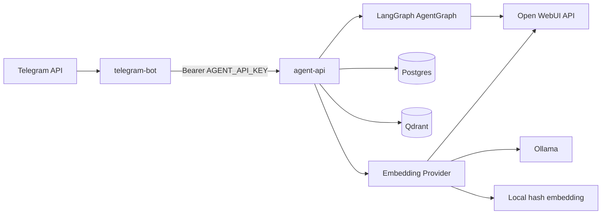
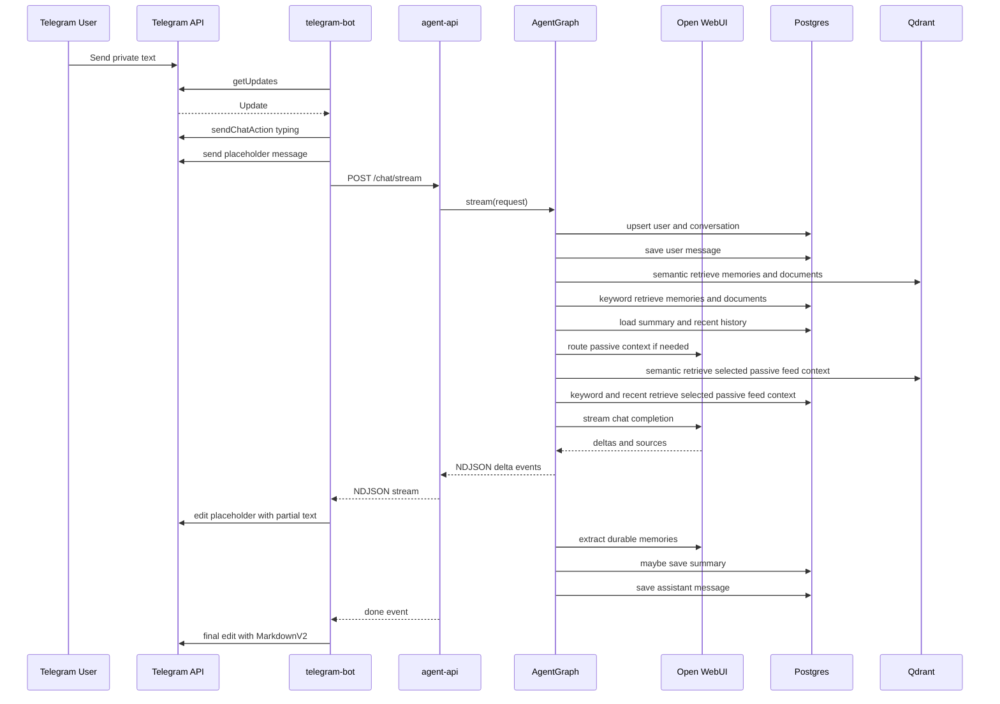
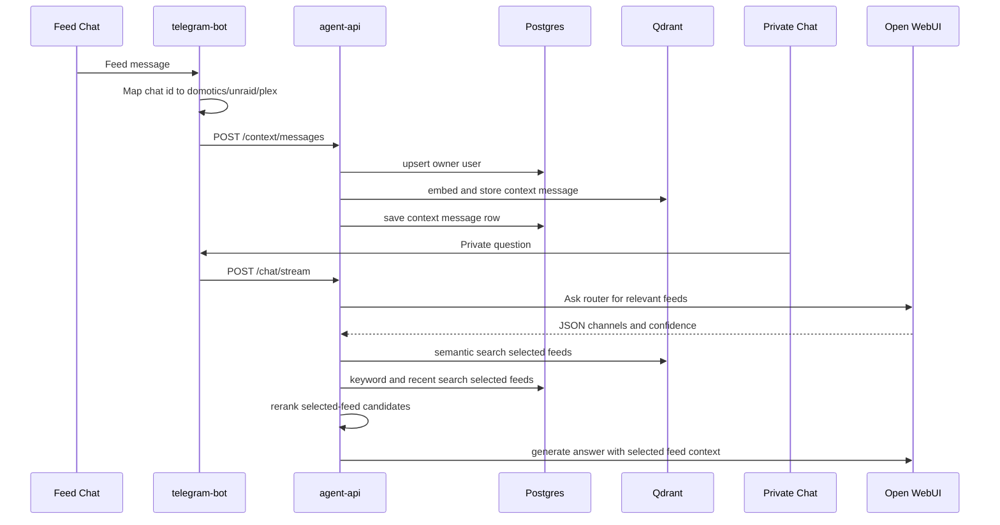

# Codee Implementation Guide

This document describes how the current Codee stack is implemented internally.
It is intended for developers and operators who need to understand the runtime
pipeline, persistence model, service boundaries, and integration points.

The stack replaces a single polling bot with two application services and two
state services:

```text
Telegram -> telegram-bot -> agent-api -> LangGraph -> Open WebUI
                                  |-> Postgres
                                  |-> Qdrant
```

Open WebUI remains external to Docker Compose. The Compose stack provides the
Telegram polling bot, the FastAPI agent API, Postgres, and Qdrant.

## Service Topology



### Runtime Services

- `telegram-bot` polls Telegram with `getUpdates`, routes updates, and sends or
  edits Telegram messages.
- `agent-api` exposes FastAPI endpoints, initializes all dependencies during
  application startup, and runs the LangGraph response pipeline.
- `postgres` stores durable relational state: users, conversations, messages,
  summaries, source-backed memory metadata, document metadata, passive context
  messages, keyword-search indexes, and tool-call records.
- `qdrant` stores vectors for semantic retrieval. It is used for extracted
  memories, document chunks, and passive feed messages.
- Open WebUI is called through its native API for chat generation, streaming,
  optional web search, source extraction, and optionally embeddings.
- Ollama can be used directly for embeddings and as a fast status check before
  using the primary Open WebUI model.

## FastAPI Initialization

`agent-api/app/main.py` owns service construction in the FastAPI lifespan hook.
On startup it:

1. Loads `Settings` from environment variables via `pydantic-settings`.
2. Creates a `Database` and runs `init_schema()`.
3. Creates an `OpenWebUIClient` for chat, streaming, optional web search, and
   fallback routing.
4. Selects the embedding provider:
   - `hash` for local deterministic embeddings.
   - `openwebui` for `POST /api/embeddings`.
   - `ollama` for direct `POST /api/embed`.
5. Creates a `VectorStore`, then initializes Qdrant collections.
6. Creates the repository and domain services:
   - `AgentGraph`
   - `DocumentService`
   - `ForgetService`
   - `SummaryService`
7. Stores these objects in `app.state` for endpoint handlers.

All non-health endpoints require `Authorization: Bearer ${AGENT_API_KEY}`. The
authentication check is shared through `require_api_key`.

## Public Agent API

The API surface is intentionally small:

| Endpoint | Purpose |
| --- | --- |
| `GET /health` | Checks Postgres and returns service health. |
| `POST /debug/llm` | Sends one non-streaming prompt through Open WebUI. |
| `POST /debug/embedding` | Embeds one text value and returns vector metadata. |
| `POST /chat/stream` | Streams private chat responses as NDJSON events. |
| `POST /context/messages` | Stores passive feed messages for later retrieval. |
| `POST /summary` | Returns the latest stored summary for a conversation. |
| `POST /forget` | Deletes stored state for one channel or all user channels. |
| `POST /documents/upload` | Uploads text/PDF content and indexes its chunks. |

`/chat/stream` returns `application/x-ndjson`. The main event types are:

- `delta`: partial assistant text.
- `done`: final reply, conversation id, and source list.
- `error`: recoverable API, embedding, vector-store, or internal failure.

## Private Telegram Chat Pipeline

Private messages are handled by `telegram-bot` and streamed through `agent-api`.



### Telegram Bot Responsibilities

`telegram-bot/app/main.py` is a polling bot, not a webhook server. It keeps the
last processed Telegram update id in `TELEGRAM_STATE_PATH` through `OffsetStore`,
which allows the container to restart without replaying all old updates.

For private chats:

- Text commands are handled locally when possible.
- Non-text messages receive a local unsupported-message reply.
- Normal text messages are sent to `POST /chat/stream`.
- The bot sends a typing action, creates a placeholder message, then edits the
  placeholder as text arrives.
- Intermediate edits use plain text to reduce Telegram formatting failures.
- The final edit uses MarkdownV2 rendering.
- If Telegram rejects MarkdownV2, the bot retries with plain text.
- Source references like `[1]` are converted into clickable superscript-style
  Telegram citations when Open WebUI returns source URLs.

Local command handling covers:

- `/start`
- `/help`
- `/summary`
- `/forget`
- `/forget <days>`
- `/forget_all`
- `/forget_all <days>`

`/summary`, `/forget`, and `/forget_all` are parsed locally but call `agent-api`
for stored data access. Other supported simple command replies are generated
inside the bot.

## LangGraph Response Pipeline

The core orchestration lives in `agent-api/app/agent_graph.py`. The compiled
graph has the following nodes:

```text
load_or_create_user
load_or_create_conversation
save_user_message
retrieve_memories
retrieve_documents
load_summary
load_recent_history
choose_context_channels
retrieve_context_messages
generate_response
maybe_extract_memory
maybe_update_summary
save_assistant_message
```

For streaming requests, `AgentGraph.stream()` prepares the state through the
same retrieval and context-selection steps, then calls `OpenWebUIClient.stream_chat()`.
It yields each LLM delta immediately, accumulates the final reply, extracts
memories, maybe updates the summary, saves the assistant message, and emits a
final `done` event.

Commands are treated specially. If the incoming text starts with `/`, vector
search and LLM calls are skipped for command replies, and the assistant message
is still saved.

### Hybrid Retrieval and Reranking

Private memories, private documents, and router-selected passive feed messages
use the same local ranking pattern:

1. Retrieve a wider candidate set from Qdrant using dense embeddings.
2. Retrieve matching rows from Postgres full-text search using `simple`
   `tsvector` indexes.
3. Add recent passive feed rows for the router-selected feed channels.
4. Merge duplicate hits by point id, chunk id, Telegram message id, or content.
5. Filter candidates to the allowed channel and source type.
6. Rerank with a deterministic hybrid score that combines semantic similarity,
   keyword overlap, recency, and memory importance.

This reranker lives in `agent-api/app/retrieval.py`. It does not call an LLM or
external service. The passive-feed router remains the only component that can
select `domotics`, `unraid`, or `plex`; hybrid retrieval operates only inside
the channels returned by that router.

### Prompt Assembly

The final prompt starts with `SYSTEM_PROMPT`, then appends context blocks when
available:

- Context priority rules.
- Latest private chat summary.
- Relevant private memories.
- Relevant private documents.
- Selected passive feed context.
- Recent private message history as chat messages.

The priority rules tell the model to resolve follow-up references from recent
private history, prefer stored passive feed context for `domotics`, `unraid`,
and `plex` questions, and only use Open WebUI web search after stored context is
insufficient.

For follow-up questions that explicitly refer to "this number" or "that number",
the prompt includes a small deterministic reference-resolution hint derived from
the recent private assistant messages when a number is available.

### Memory Extraction

After a normal assistant reply, the graph asks the LLM to extract durable facts,
preferences, project details, or recurring instructions from the latest exchange.
The expected response is JSON with a `memories` array. Up to five valid memories
are:

1. Deduplicated against existing memories for the same user and channel.
2. Embedded and upserted into Qdrant's user memory collection.
3. Stored in Postgres with metadata including `memory_type`, `importance`,
   `confidence`, source user message id, source text, conversation id, channel,
   and Qdrant point id.

If extraction fails or returns invalid JSON, the chat response still succeeds.

### Summary Updates

Conversation summaries are updated every `SUMMARY_EVERY_N_MESSAGES` messages.
When the message count hits that interval, the graph sends the previous summary
and recent transcript to the LLM, then saves the returned summary in Postgres.

## Passive Feed Context Pipeline

Configured Telegram chats are passive feeds. They are not answered by the bot.
They are stored as context for the owner user configured by
`CONTEXT_OWNER_TELEGRAM_USER_ID`.



Feed chat ids are mapped in `telegram-bot` settings:

- `DOMOTICS_CHAT_ID` -> `domotics`
- `UNRAID_CHAT_ID` -> `unraid`
- `PLEX_CHAT_ID` -> `plex`

Only text feed messages are stored. The bot sends `POST /context/messages` with
the owner Telegram user id, feed chat id, channel, Telegram message id, sender
metadata, and text.

The API stores each passive message twice:

- In Qdrant's documents collection with `source_type = context_message`.
- In Postgres `context_messages` with the Qdrant point id.

During private chat, the context router asks the LLM for strict JSON with:

- `channels`
- `confidence`
- `rationale`

Only `domotics`, `unraid`, and `plex` are accepted. If confidence is below
`CONTEXT_ROUTER_MIN_CONFIDENCE`, no passive feed is used. When channels are
selected, the API searches only those channels. Semantic Qdrant hits, Postgres
keyword hits, and recent Postgres feed rows are merged, filtered to the selected
channels, deduplicated, and reranked down to `CONTEXT_ROUTER_MAX_FEED_MESSAGES`.
No keyword or vector retrieval path can add a passive feed channel that the
router did not select.

When `CONTEXT_ROUTER_ENABLED=false`, passive feed routing is skipped.

## Document Upload Pipeline

`POST /documents/upload` is implemented in `DocumentService`.

The endpoint accepts multipart form fields for user/chat/channel metadata plus
one uploaded file. If `telegram_chat_id` is provided, `channel` is required so a
conversation can be associated with the upload.

Ingestion steps:

1. Read the uploaded bytes.
2. Extract text:
   - PDF files use `pypdf.PdfReader`.
   - Other files are decoded as UTF-8 with replacement for invalid bytes.
3. Truncate text to `MAX_DOCUMENT_CHARS`.
4. Chunk text with structure-aware rules:
   - log-style timestamps are kept as entry boundaries when possible;
   - Markdown-like headings and paragraph blocks are kept together when possible;
   - long unstructured blocks fall back to 1200 character chunks with 150
     character overlap.
5. Create a Postgres `documents` row.
6. Insert each chunk into Postgres with a temporary `pending` Qdrant point id.
7. Embed and upsert each chunk into Qdrant.
8. Update each Postgres chunk row with the final Qdrant point id.

Document chunks are stored in the Qdrant documents collection with
`source_type = document_chunk`.

The Telegram bot currently handles text only, so document upload is exposed by
the API but not wired into Telegram message handling.

## Storage Model

### Postgres

The schema is created and migrated opportunistically by `Database.init_schema()`.
It includes:

- `users`: one row per Telegram user id.
- `conversations`: one row per user/channel pair, with Telegram chat id.
- `messages`: user and assistant messages for private conversations.
- `context_messages`: passive feed message records.
- `conversation_summaries`: generated summaries over time.
- `memories`: durable extracted memory metadata, source evidence, importance,
  confidence, and Qdrant point ids.
- `documents`: uploaded document metadata.
- `document_chunks`: extracted chunks and Qdrant point ids.
- `tool_calls`: reserved storage for tool-call logging.

Postgres is the durable source for relational lookup, deletion counts, recent
history, keyword retrieval, recent feed fallback, and summary retrieval. Qdrant
point ids are stored in Postgres so deletes can remove matching vectors later.

### Qdrant

`VectorStore` uses two logical collections:

- `user_memories`
- `documents`

The documents collection stores both document chunks and passive feed messages.
Payload filters distinguish them:

- `source_type = document_chunk`
- `source_type = context_message`

When a collection already exists with a different vector size, the application
does not delete or mutate it. Instead it creates a dimension-specific collection
name such as `user_memories_2560` or `documents_2560`.

All vector searches filter by `user_id`. Memory and document searches can also
filter by channel. Real prompt context is assembled only after local hybrid
reranking merges these vector hits with Postgres keyword candidates.

## Embeddings

Embedding behavior is selected by `EMBEDDING_PROVIDER`.

### `hash`

The local hash provider produces deterministic vectors without any external
service. It lowercases and splits text into tokens, hashes each token, adds a
signed value into the configured vector dimension, then normalizes the vector.
This is useful for local smoke tests and dependency-light startup.

### `openwebui`

The Open WebUI provider calls:

```text
POST /api/embeddings
```

The embedding model defaults to `EMBEDDING_MODEL` when set, otherwise the chat
model is used.

### `ollama`

The Ollama provider calls:

```text
POST /api/embed
```

When `EMBEDDING_PROVIDER=ollama`, `EMBEDDING_MODEL` is required. The configured
`VECTOR_SIZE` must match the embedding model output size, because Qdrant
collections are created with that dimension.

## Open WebUI Chat Integration

`OpenWebUIClient` is responsible for both non-streaming and streaming chat.

For each chat request it:

1. Optionally creates a temporary Open WebUI chat with `POST /api/v1/chats/new`.
2. Calls `POST /api/chat/completions`.
3. Parses assistant content and source documents.
4. Deletes the temporary chat with `DELETE /api/v1/chats/{id}` when a chat id was
   created.

If chat creation fails, the client logs the failure and continues without a
`chat_id`. Chat completion failure raises an `OpenWebUIError`, which API
endpoints convert to either `502` responses or stream `error` events.

When `OPENWEBUI_USE_WEB_SEARCH=true`, chat requests include `tool_ids` with
`web_search`. Router, memory extraction, and summary calls explicitly disable
web search because they are internal control prompts.

### Fallback Model Routing

If `OPENWEBUI_FALLBACK_MODEL` is set and differs from `OPENWEBUI_MODEL`, the
client has two chat routes on the same Open WebUI base URL:

1. Primary model.
2. Fallback model.

Before chat generation, the client can check `OLLAMA_BASE_URL/api/tags` using
`OLLAMA_STATUS_TIMEOUT_SECONDS`. If that fast status check fails, the fallback
model is tried before the primary model. Streaming fallback only retries another
route if the failure happens before any content delta has been emitted.

## Forget and Summary Behavior

### Summary

`POST /summary` looks up the Telegram user, then the conversation by channel. If
there is no user, conversation, or summary, it returns a "No summary is stored
yet" reply. Otherwise it returns the latest summary and creation timestamp.

### Forget

`POST /forget` supports two scopes:

- `channel`: delete only the requested channel.
- `all`: delete all stored channels for the user.

It also supports an optional `days` value. When present, only rows created from
the cutoff time onward are removed.

The deletion pipeline:

1. Resolve the Telegram user.
2. Compute the optional UTC cutoff.
3. Delete matching relational rows from Postgres.
4. Collect Qdrant point ids from deleted memories, document chunks, and passive
   context messages.
5. Delete matching points from Qdrant.
6. Return a human-readable confirmation plus deletion counts.

`/forget_all` in Telegram maps to the API's `scope = all`; `/forget` maps to
`scope = channel`.

## Retrieval Evaluation

`agent-api/scripts/evaluate_retrieval.py` provides a small dependency-light
golden-set evaluator for the local reranker. It can run with built-in examples:

```powershell
python agent-api\scripts\evaluate_retrieval.py
```

It reports JSON with average `recall_at_k`, `mrr`, `context_precision`, and
ranking latency. A custom JSON case file can be supplied with `--cases`; each
case contains a query, expected candidate ids, optional allowed channels, and
candidate payloads. The script evaluates the same `hybrid_rerank()` function
used by the application.

## Logging and Debugging

Both Python services use compact one-line logging controlled by `LOG_LEVEL`.
Routine HTTP client logs and noisy infrastructure logs are reduced by default.
Docker logging is bounded by the Compose `json-file` settings.

`CONTEXT_DEBUG_JSON=true` enables structured JSON-shaped debug logs for context
behavior. These logs can include user message text, feed message text, router
decisions, retrieved hits, and prompt context sections. It should be enabled
only while diagnosing routing or retrieval behavior.

Useful debug events include:

- Telegram route decisions.
- Passive context ingestion requests and responses.
- Context router requests, parse failures, and selected channels.
- Semantic, keyword, recent, and reranked passive feed retrieval results.
- Final prompt context assembly.

## Error Handling

The API converts expected integration failures into explicit responses:

- Open WebUI failures become `502` responses for debug calls or stream `error`
  events for chat.
- Embedding failures become `502` responses or stream `error` events.
- Qdrant search/delete failures become `502` responses or stream `error` events.
- Unexpected chat stream exceptions are logged and returned as a generic stream
  `error` event.

The Telegram bot handles failed streaming startup, failed stream completion, and
Telegram MarkdownV2 rejection with user-facing fallback messages or plain-text
retries.

## Operational Notes

- `AGENT_API_URL` should point to `http://agent-api:8000` inside Compose.
- The host-facing API port is mapped as `8002:8000` in `docker-compose.yml`.
- `DATABASE_URL` must match the Postgres user, password, and database configured
  for the `postgres` service.
- `QDRANT_URL` points to the Compose service from inside `agent-api`.
- `OPENWEBUI_BASE_URL` points to the external Open WebUI instance, often through
  `host.docker.internal` when Open WebUI runs on the Docker host.
- Secrets should stay in `.env` and should not be copied into documentation,
  tests, or logs.
